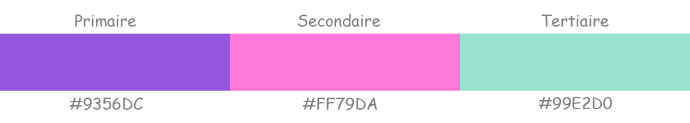

#Identité

 -Ohmyfood ! Est une entreprise de commande de repas en ligne. 
 
 -Le concept est de permettre aux utilisateurs de composer leur propre menu et réduire leur temps
d’attente dans les restaurants, car leur menu est préparé à l’avance.

 -Déjà développé à New-York dans un premier temps, Oh my Food souhaite élargit son 
 concept sur la capitale de la gastronomie : Paris.

-Ils ciblent les restaurants luxueux des villes dans lesquelles ils sont établis et souhaite être identifié
comme une entreprise proposant des services haut de gamme.

-Ils ciblent les classes moyennes et supérieures, connectées et souvent pressées.

# Identité graphique
## *Police*

Logo et titre: **Shrikhand**

Texte: **Roboto**

## *Couleurs*

*Primaire:* **#9356DC**

*Secondaire:* **#FF79DA**

*Tertiaire:* **#99E2D0**

# Contraintes
- Développement en CSS, sans JS
- Aucun framework à l'exception de SASS (à utiliser)
- Aucune balise CSS dans le html
- Mobile-first mais compatible tout supports
- Validation W3C HTML et CSS sans erreurs
- Site fonctionnel sous les dernières version de Chrome / Firefox

# Livrables

- **Page d'acceuil (x1)**
    - Affichage de la localisation des restaurants.
    - Courte présentation de l'entreprise.
    - Section contenant 4 menus sous forme de cartes. Redirection vers là page en question au clic.
- **Pages de menu (x4)**
    - 4 pages menu de restaurant minimum.
- **Footer**
    - Footer identique sur toutes les pages.
    - Contact renvoie vers une adresse mail.
- **Header**
    - Header présent sur toutes pages.
    - Sur la page d'acceuil, il contient le logo.
    - Sur les pages menu, il contient un bouton retour sur la page d'acceuil

# Effets Graphique et Animations

- **Boutons**
    - Au survol, la couleur de fond des boutons principaux devra légèrement s’éclaircir. L’ombre portée devra également être plus visible.
    - Bouton "J'aime" en forme de coeur, se remplie progressivement au clic, peut ce remplir au survol sous la version desktop.
- **Page d'acceuil**
    - Un "loading spinner" à l'arrivé sur le site, d'une durée de 1 à 3 secondes, création libre avec respect de la charte graphique (utilisation des animations CSS uniquement)
- **Pages Menu**
    - Apparition des plats progréssif avec un leger décalage. (Apparition un par un ou par groupe “Entrée”, “Plat” et “Dessert”)
    - À l'ajout d'un plat à la commande (au clic), une coche doit apparaitre à droite du plat, cette coche devra coulisser de droite à gauche. (Si l'intitulé de plat est trop long, il devra être rogné avec des points de suspension)
